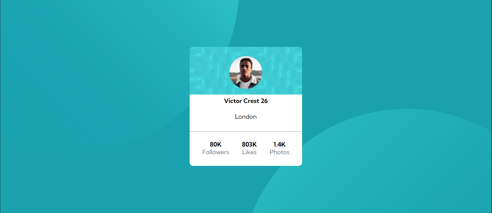
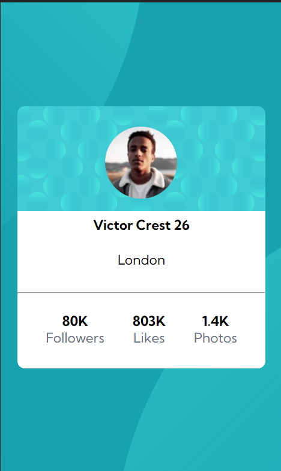

# Desafio Dev Quest - Profile card component 

Esta é uma soluçao para o desafio [Profile card component challenge no Dev Quest]
## Table of contents

- [Visão Geral](#visão-geral)
  - [O Desafio](#o-desafio)
  - [Screenshot](#screenshot)
  - [Links](#links)
- [Meu Processo](#meu-processo)
  - [Desenvolvido Com](#desenvolvido-com)
  - [O que eu aprendi](#o-que-eu-aprendi)
  

## Visão Geral

### O Desafio

- Construir o projeto de acordo com os designs fornecidos

### Screenshot

**Versão Desktop**

**Versão Mobile**

### Links

- Repositório:
- Github Pages:

## Meu Processo
Primeiramente iniciei a construção da base HTML e depois passei para a estilização com CSS, finalizando com o responsivo do mobile.

### Desenvolvido Com

- HTML5 
- CSS 
- Flexbox
- Responsive Mobile

### O que eu aprendi

Pude colocar em prática todo o conteúdo adqurido nos módulos de HMTL e CSS, mas pude aprender como solucionar problemas que não sabia como resolver, dando continuidade no desenvolvimento do código. 

Um dos exemplos foi o posicionamento das imagens no fundo do layout. Posicioná-las deu um pouco de trabalho, mas no fim consegui.

🎉🎉🎉
